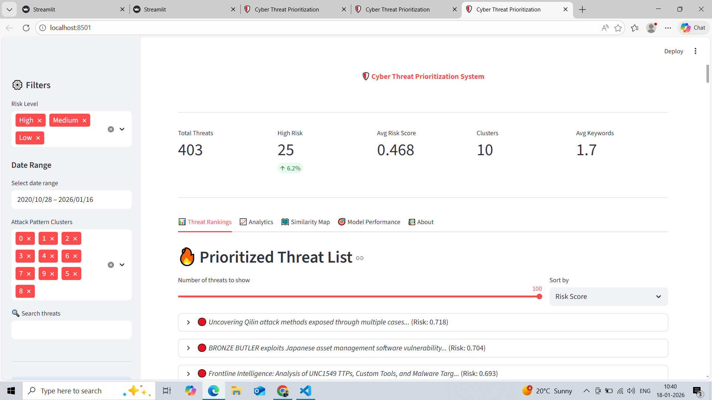
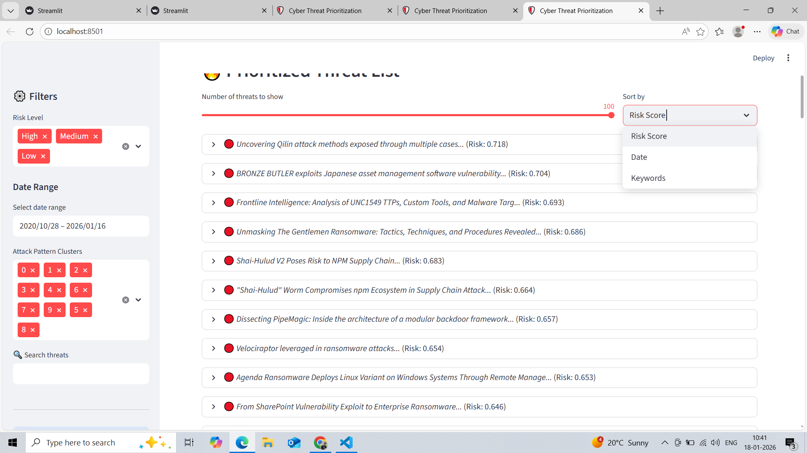
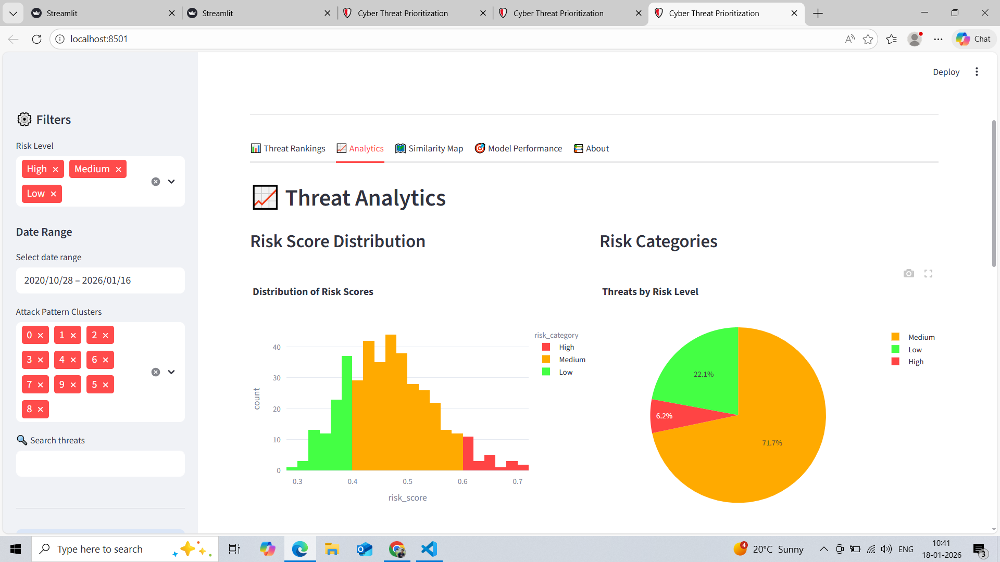
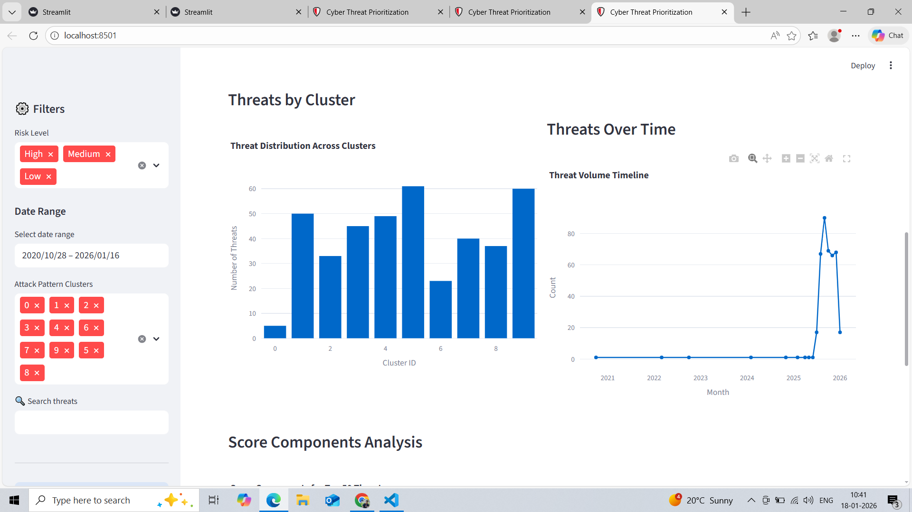
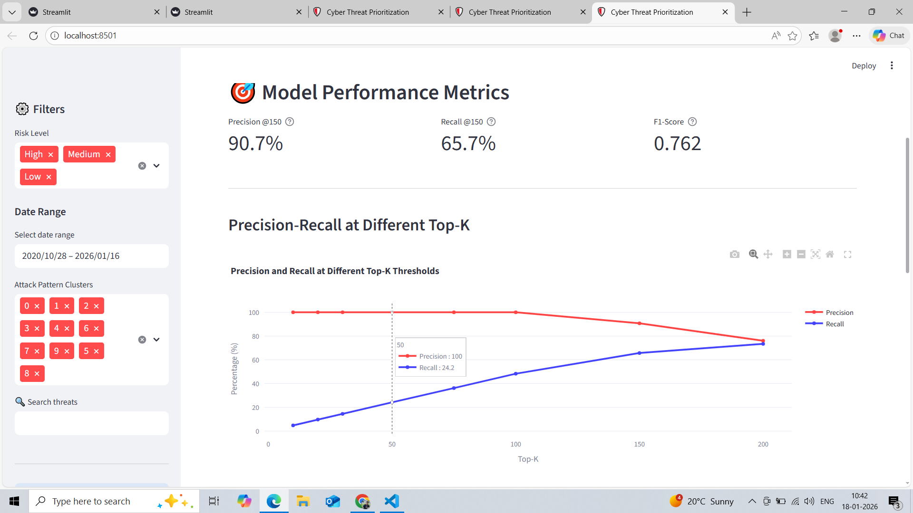
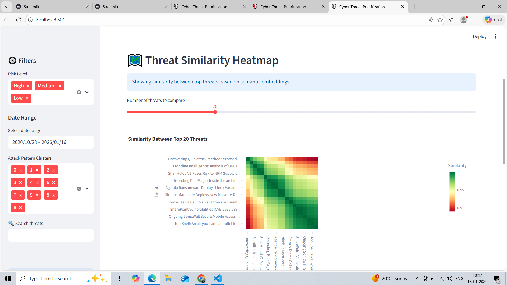

# 🛡️ AI-Powered Cyber Threat Prioritization System

An ML-powered threat intelligence system that helps Security Operations Center (SOC) analysts prioritize cyber threats by ranking them based on similarity to verified critical incidents, MITRE ATT&CK keyword matching, and novelty detection.

## 🎯 Key Features

- *Intelligent Threat Ranking*: Scores threats based on similarity to CISA critical incidents, MITRE ATT&CK patterns, and novelty
- *Pattern Detection*: Unsupervised clustering identifies 10 distinct attack patterns
- *Real-time Dashboard*: Interactive Streamlit interface for threat analysis
- *Production-Ready*: Docker containerization, CI/CD pipeline, comprehensive testing
- *Explainable AI*: Transparent risk scoring with component breakdowns

## 📊 Performance Metrics

| Metric | Value |
|--------|-------|
| Precision @150 | *90.7%* |
| Recall @150 | *65.7%* |
| F1-Score | *0.762* |
| Baseline Improvement | *+108%* |
| Processing Speed | 405 threats in 47 seconds |
| Deduplication Rate | 5.4% |

*Why Top-150?* Security analysts typically review 100-150 threats per day. This threshold balances precision (minimizing false alarms) with recall (catching critical threats) for real-world SOC workflows.

## 🚀 Quick Start

### Using Docker (Recommended)

bash
# Clone repository
git clone https://github.com/Arithra2006/cyber-threat-prioritization.git
cd cyber-threat-prioritization

# Run with Docker Compose
docker-compose up

# Access dashboard at http://localhost:8501

### Local Installation

bash
# Create virtual environment
python -m venv venv
source venv/bin/activate  # On Windows: venv\Scripts\activate

# Install dependencies
pip install -r requirements.txt

# Set up environment variables
cp .env.example .env
# Edit .env and add your AlienVault OTX API key

# Run data collection
python src/data_collection/fetch_otx_threats.py

# Run ML pipeline
python -m src.ml_pipeline.pipeline

# Launch dashboard
streamlit run src/dashboard/app.py

# View MLflow experiments (optional)
mlflow ui
# Then open http://localhost:5000

## 📁 Project Structure

cyber-threat-prioritization/
├── src/
│   ├── data_collection/       # OTX API, MITRE, CISA data
│   ├── ml_pipeline/            # Embeddings, clustering, scoring
│   └── dashboard/              # Streamlit interface
├── tests/                      # Unit tests (pytest)
├── data/
│   ├── raw/                    # Raw threat data
│   └── processed/              # Scored threats, models
├── mlruns/                     # MLflow experiment tracking
├── docker-compose.yml          # Container orchestration
├── Dockerfile                  # Container image
├── requirements.txt            # Python dependencies
└── README.md

## 🔬 How It Works

### 1. Data Collection
- Fetches threat intelligence from *AlienVault OTX* API
- Applies quality filters (description length, relevant tags)
- Collected 428 high-quality threats

### 2. ML Pipeline

*Embedding Generation*
- Uses sentence-transformers/all-MiniLM-L6-v2 (384-dimensional vectors)
- Converts threat descriptions to semantic embeddings

*Deduplication*
- Cosine similarity threshold: 0.85
- Removes near-duplicate threats (5.4% reduction)

*Clustering*
- KMeans clustering (k=10)
- Groups threats into attack patterns
- Identifies ransomware, phishing, supply chain, APT clusters

*Risk Scoring*

Risk Score = 0.50 × Similarity + 0.40 × Keywords + 0.10 × Novelty

- *Similarity (50%)*: Cosine similarity to 12 verified CISA critical incidents
- *Keywords (40%)*: MITRE ATT&CK technique matching
- *Novelty (10%)*: Distance from cluster centroids

-MLflow Tracking
-Logs all pipeline parameters (model configs, thresholds)
-Tracks 20+ metrics (accuracy, deduplication rate, cluster stats)
-Stores artifacts (models, reports, scored threats)
-Enables experiment comparison and reproducibility

### 3. Interactive Dashboard

- 📊 *Threat Rankings*: Sorted by risk score with expandable details
- 📈 *Analytics*: Risk distribution, cluster patterns, timeline
- 🗺️ *Similarity Map*: Heatmap of threat relationships
- 🎯 *Performance Metrics*: Precision/recall curves, baseline comparison

## 🧪 Testing

bash
# Run all tests
pytest tests/ -v

# Run with coverage
pytest tests/ --cov=src --cov-report=html

# Run specific test file
pytest tests/test_risk_scoring.py -v

*Test Coverage*: 15+ unit tests covering embeddings, deduplication, clustering, and risk scoring.

## 📈 Evaluation

### Baseline Comparison (Top-50)

| Method | Recall | Precision |
|--------|--------|-----------|
| Random Ranking | 12.1% | ~51% |
| Recency-Only | 11.6% | ~53% |
| *Our System* | *24.2%* | *100%* |
| *Improvement* | *+108%* | *+96%* |

### Precision-Recall Trade-off

| Top-K | Precision | Recall  | F1-Score |
|-------|-----------|-------- |----------|
| 50    | 100.0%    | 24.2%   | 0.389 |
| 100   | 100.0%    | 48.3%   | 0.651 |
| 150   | 90.7%     | 65.7%   | 0.762 |
| 200   | 76.0%     | 73.4%   | 0.747 |

## 🛠️ Technology Stack

- *ML/AI*: SentenceTransformers, scikit-learn, NumPy, pandas
- *Dashboard*: Streamlit, Plotly
- *MLOPS*:MLflow(experiment tracking),structlog(logging)
- *Data Sources*: AlienVault OTX, MITRE ATT&CK, CISA Advisories
- *Infrastructure*: Docker, Docker Compose
- *Testing*: pytest, GitHub Actions

## 🎓 Use Cases

- *SOC Threat Triage*: Prioritize daily threat feed review
- *Incident Response*: Identify high-priority threats requiring immediate action
- *Threat Intelligence*: Discover emerging attack patterns
- *Security Research*: Analyze threat landscape trends

## ⚠️ Limitations

- *Static Dataset*: Snapshot from OTX (not live feed)
- *Equal Weights*: Not optimized for specific environments
- *Small Ground Truth*: Only 12 CISA incidents for similarity scoring
- *No Temporal Modeling*: Doesn't track threat evolution over time

## 🔮 Future Enhancements

- [ ] Live threat feed integration
- [ ] Analyst feedback loop for weight optimization
- [ ] Expanded ground truth (100+ critical incidents)
- [ ] Multi-model ensemble (combine multiple embeddings)
- [ ] Temporal pattern detection (trend analysis)
- [ ] Custom MITRE ATT&CK mappings per organization

## 🙏 Acknowledgments

- *AlienVault OTX*: Threat intelligence data
- *MITRE Corporation*: ATT&CK Framework
- *CISA*: Critical incident advisories
- *Hugging Face*: Sentence-Transformers models

## 📧 Contact

*Arithra Mayur* - [arithramayur@gmail.com](mailto:arithramayur@gmail.com)

Project Link: [https://github.com/Arithra2006/cyber-threat-prioritization]

---
